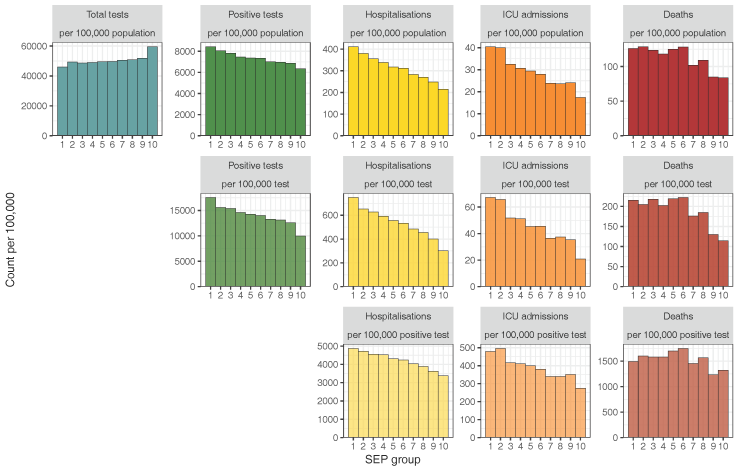

## Socioeconomic inequalities 

When the [Swiss-SEP index](../swisssep/) was created I could have never imagined it being used to track health outcomes during the pandemic. We used Federal Office of Public Health's COVID-19 surveillance data to investigate trends in testing, testing positive, being hospitalized, being admitted to ICU and death among Swiss population. Our results pointed to an increased risk of adverse outcomes in lower socioeconomic individuals, adding to evidence from other countries and demonstrating inequalities in how the pandemic affected different groups of population. You can read more about our findings [here](https://doi.org/10.1016/S2468-2667(21)00160-2).  

## Historical trends in excess mortality

[Excess mortality](https://ourworldindata.org/excess-mortality-covid) is an extremely useful measure that helps in quantification of the impact of significant events on the health of population. We used over 100 years of data to look at the patterns of excess mortality in three countries. We found that during the COVID-19 pandemic in 2020-21 Spain, Sweden, and Switzerland recorded their highest monthly excess all-cause mortality levels since the 1918 influenza pandemic. You can read more about our findings in a preprint [here](https://doi.org/10.1101/2021.08.12.21261825). Additional materials are available from project's [website](https://rpanczak.github.io/ISPM_excess-mortality/).  

## Spatial patterns of excess mortality

The newest, *ongoing* project investigates spatial patterns of excess mortality in Switzerland in 2020-21. We know from other studies that mortality (as well as other health outcomes) vary substantially over geographical regions of Switzerland. We will use Federal Statistical Office's monthly, community-level death counts to see if during the pandemic the spatial pattern of deaths changed compared to what we would expect on the basis of previous years. The progress of the work can be tracked on the project's [website](https://rpanczak.github.io/ISPM_geo-mortality/). 