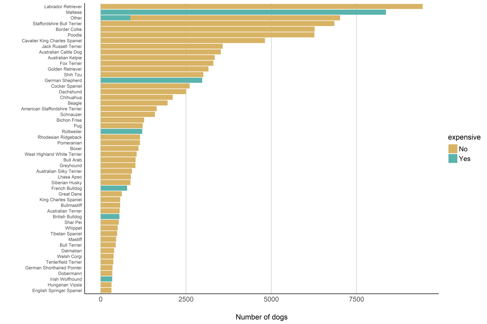

## Swisscom  

Swisscom is the largest mobile phone operator in Switzerland. Mobility Insights product is their product offering access to gridded data based on mobile phone usage. This [repository](https://github.com/RPanczak/FUN_swisscom) collects few simple attempts of accessing, munging and visualizing these data. Few preliminary findings are presented on project's [website](https://rpanczak.github.io/FUN_swisscom/).  

## Brisbane dogs 

Some time ago I came across Brisbane City Council's [data](https://www.data.brisbane.qld.gov.au/data/dataset/current-animal-related-permits) on animal permits. From time to time I like to use it for various purposes. In between the jobs and during the lockdown I tried to see if the number of expensive dogs  correlates with any of Australian indices of deprivation. More recently I use this dataset to test various machine learning models and methods. Repository continue to grows [here](https://github.com/RPanczak/FUN_BCC-animals) and few first results can be found on the project's [website](https://rpanczak.github.io/FUN_BCC-animals/). First analyses look at the animal permits but future ones will also look at spatiotemporal series of animal complaints [data](https://www.data.brisbane.qld.gov.au/data/dataset/animal-related-complaints).  

## STATPOP spatial

Coming soon ...   
