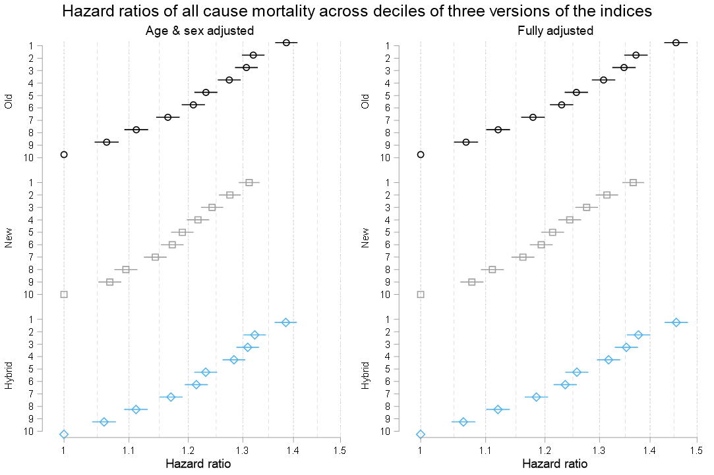

## Original (1.0)

The [original paper](https://pubmed.ncbi.nlm.nih.gov/22717282/) describing the index was published in 2012 as a part of my PhD. It presented two years of work aiming at creation of an area-based socioeconomic position (SEP) in Switzerland. We used most comprehensive Census 2000 data available via Swiss National Cohort project to describe four domains of SEP of the area: education, employment, income and housing. We combined established methods of combining these measures with novel approach of defining custom neighbourhoods' boundaries using geographic coordinates of virtually all residential buildings and road network connections between them. With 1.27 million geographical areas this is probably to this day the most accurate area-based measure of SEP. 

## Update (2.0 & 3.0)

The original index is based on data collected over 20 years ago. We wanted to know if index can still be used and if it can be improved using newer data. We first created version 2.0 of the index that used yearly micro censuses that replaced decennial census in Switzerland and used updated data from Swiss Household Panel to check if we can validate it and more recent mortality data from the Swiss National Cohort to check if it is still associated with mortality. Finally we tested another idea of creating *hybrid* measure where we combined 'old' index with 'new' and updated it only for the buildings constructed more recently. These explorations and the newly proposed index are described in our preprint [here](https://osf.io/r8hz7/) with supplementary materials available on [OSF](https://osf.io/ncw9s/). 

## Future (4.0)

It seems like the work on index is newer finished! The new micro census data arrive every year and newer or more data could be used to create index. These data could better capture current population and the buildings and flats they reside in. More up to date road network data is available too. The project could be made more transparent by adopting open source solution for the step of the road network connectivity and releasing code used to generate the outputs and intermediate data. How many of these items and how we managed to fix will be (slowly) tracked on the project's [repository](https://github.com/RPanczak/SNC_Swiss-SEP4/). 

## Data access

Index is there to be used! Over hundred papers cited it with few dozens using it directly in various epidemiological research on life expectancy, environmental and lifestyle exposures, assisted suicide, cancer, HIV, amyotrophic lateral sclerosis, and randomised trials just to name the few. We are not able to release the index as an open dataset but it can easily be available, free of charge for research purposes. Please see this [website](https://www.swissnationalcohort.ch/data-and-access/) for more details.  